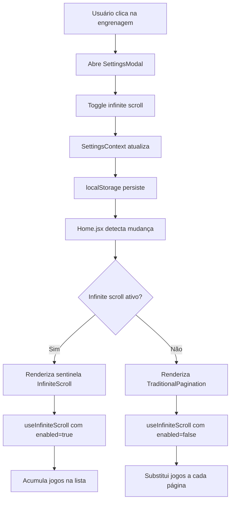

# Configuração de Infinite Scroll

## Visão Geral

Implementamos um sistema de configurações que permite ao usuário habilitar/desabilitar o infinite scroll, alternando entre navegação automática e paginação tradicional.

## Arquitetura da Solução

### Componentes Principais

#### 1. SettingsContext (`/src/contexts/SettingsContext.jsx`)
- **Responsabilidade**: Gerenciar todas as configurações da aplicação
- **Persistência**: localStorage com chave `ps-games-settings`
- **Configurações Disponíveis**:
  - `infiniteScrollEnabled` (boolean): Controla infinite scroll
  - `itemsPerPage` (number): Itens por página
  - `theme` (string): Tema da aplicação

#### 2. SettingsModal (`/src/components/SettingsModal.jsx`)
- **Responsabilidade**: Interface para alterar configurações
- **Acesso**: Botão de engrenagem no header
- **Features**:
  - Toggle para infinite scroll
  - Botão para restaurar padrões
  - Informações contextuais sobre cada configuração

#### 3. Hook useInfiniteScroll (Modificado)
- **Nova propriedade**: `enabled` (boolean)
- **Comportamento**:
  - `enabled: true` → Infinite scroll tradicional
  - `enabled: false` → Carrega páginas substituindo conteúdo (paginação)

#### 4. TraditionalPagination (`/src/components/TraditionalPagination.jsx`)
- **Responsabilidade**: Componente de paginação tradicional
- **Features**:
  - Navegação anterior/próximo
  - Seleção direta de página
  - Informações de paginação
  - Responsivo (compacto no mobile)

### Fluxo de Funcionamento



## Implementação Técnica

### 1. Integração no App.jsx

```jsx
function App() {
  return (
    <AuthProvider>
      <SettingsProvider>  {/* Novo contexto */}
        <ThemeProvider theme={theme}>
          {/* ... resto da aplicação */}
        </ThemeProvider>
      </SettingsProvider>
    </AuthProvider>
  );
}
```

### 2. Navbar com Botão de Configurações

```jsx
// Botão de configurações no header
<Tooltip title="Configurações">
  <IconButton
    onClick={handleSettingsClick}
    sx={{ 
      '&:hover': { 
        color: '#0096FF',
        transform: 'rotate(180deg)'
      },
      transition: 'all 0.3s ease'
    }}
  >
    <SettingsIcon />
  </IconButton>
</Tooltip>
```

### 3. Condicional de Renderização

```jsx
{/* Home.jsx - Renderização condicional */}
{settings.infiniteScrollEnabled ? (
  /* Sentinela para infinite scroll */
  (hasMore || loading) && <InfiniteScrollSentinel />
) : (
  /* Paginação tradicional */
  <TraditionalPagination
    currentPage={currentPage}
    totalPages={totalPages}
    onPageChange={goToPage}
    onPreviousPage={goToPrevPage}
    onNextPage={goToNextPage}
    loading={loading}
    totalGames={pagination?.total}
  />
)}
```

### 4. Hook useInfiniteScroll Modificado

```jsx
export function useInfiniteScroll(fetchFunction, options = {}) {
  const { enabled = true } = options

  // Lógica de acumulação condicional
  setGames(prevGames => {
    if (reset || page === 1) {
      return response.games
    }
    
    // Se infinite scroll está desabilitado, substituir (não acumular)
    if (!enabled) {
      return response.games
    }
    
    // Infinite scroll habilitado: acumular jogos
    return [...prevGames, ...newGames]
  })

  // Observer só ativo se enabled
  useEffect(() => {
    if (!enabled) return
    // ... configuração do IntersectionObserver
  }, [enabled, ...deps])

  // Retorna funções para paginação tradicional
  return {
    // ... props existentes
    goToNextPage,
    goToPrevPage,
    goToPage,
    currentPage,
    totalPages
  }
}
```

## Interface de Usuário

### Modal de Configurações

- **Design**: Modal Material-UI com seções organizadas
- **Ícones**: Visuais intuitivos para cada configuração
- **Feedback**: Alertas contextuais explicando o estado atual
- **Persistência**: Salva automaticamente sem necessidade de botão "salvar"

### Botão de Configurações

- **Localização**: Header, ao lado do botão de logout
- **Ícone**: Engrenagem com animação de rotação no hover
- **Tooltip**: "Configurações" para acessibilidade

### Paginação Tradicional

- **Desktop**: Controles completos com primeira/última página
- **Mobile**: Versão compacta com paginação simplificada
- **Estados**: Loading, disabled, hover com feedback visual

## Testes

### Testes do SettingsContext

```jsx
describe('🚀 SettingsContext - TDD Baby Steps', () => {
  test('should provide default settings', () => {
    // Verifica configurações padrão
  })
  
  test('should update infinite scroll setting', () => {
    // Testa toggle do infinite scroll
  })
  
  test('should persist settings to localStorage', () => {
    // Verifica persistência
  })
})
```

### Cobertura de Testes

- ✅ **SettingsContext**: Todas as funcionalidades básicas
- ✅ **Persistência**: localStorage e recovery
- ✅ **Error Handling**: JSON inválido, contexto fora do provider
- 🔄 **TODO**: Testes de integração com useInfiniteScroll
- 🔄 **TODO**: Testes E2E da navegação entre modos

## Benefícios da Implementação

### ✅ Para o Usuário

- **Escolha de UX**: Pode escolher entre scroll automático ou navegação precisa
- **Persistência**: Configuração mantida entre sessões
- **Acessibilidade**: Interface intuitiva e tooltips explicativos
- **Performance**: Paginação tradicional mais eficiente para datasets grandes

### ✅ Para o Desenvolvedor

- **Escalabilidade**: Base para futuras configurações
- **Manutenibilidade**: Contexto centralizado e bem testado
- **Compatibilidade**: Não quebra funcionalidades existentes
- **Testabilidade**: TDD com boa cobertura de testes

### ✅ Para o Sistema

- **Flexibilidade**: Fácil adição de novas configurações
- **Robustez**: Tratamento de erros e fallbacks
- **Performance**: Otimização baseada na preferência do usuário

## Futuras Expansões

### Configurações Planejadas

- **Tema**: Light/Dark mode
- **Densidade**: Compacto/Padrão/Espaçoso
- **Auto-save**: Intervalo de salvamento automático
- **Notificações**: Preferências de feedback

### Melhorias Técnicas

- **Sync Multi-tab**: Sincronizar configurações entre abas
- **Import/Export**: Backup das configurações
- **Profile Settings**: Configurações por perfil de usuário 