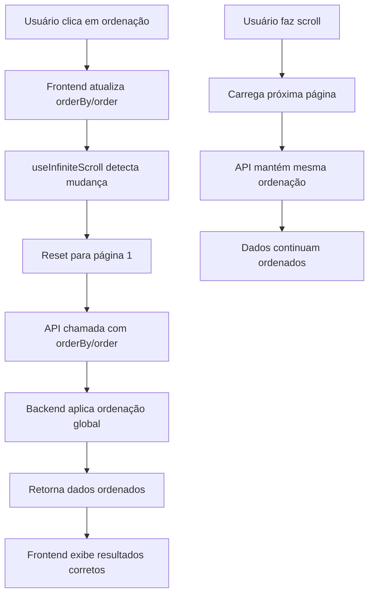

# Ordenação com Infinite Scroll

## Problema Identificado

Quando o usuário solicitava ordenação por maior nota do Metacritic, devido ao infinite scroll, o sistema mostrava apenas a maior nota dos registros já carregados no frontend, não as maiores notas globais de todo o dataset.

### Comportamento Anterior (Incorreto)
- Ordenação aplicada apenas nos dados já carregados no frontend
- Infinite scroll carregava dados sem ordenação do backend
- Resultado: ordenação parcial e incorreta

## Solução Implementada

### Arquitetura da Solução
Implementamos **ordenação no backend** com os seguintes componentes:

#### 1. Backend (API)
- **Novos parâmetros**: `orderBy` e `order` na API `/api/games`
- **Função `sortGames()`**: Ordenação centralizada no backend
- **Suporte a múltiplos campos**: name, metacritic, year, platforms, genres
- **Compatibilidade**: Mantém funcionamento sem parâmetros de ordenação

#### 2. Frontend
- **Hook `useInfiniteScroll`**: Atualizado para passar parâmetros de ordenação
- **Service `gamesService`**: Inclui orderBy e order na requisição
- **Componente Home**: Remove ordenação local, usa ordenação do backend
- **Reset automático**: Quando ordenação muda, volta para página 1

### Fluxo da Solução



## Implementação Técnica

### Backend - Função de Ordenação

```javascript
function sortGames(games, orderBy, order) {
  const sortedGames = [...games].sort((a, b) => {
    let valueA, valueB;
    
    switch (orderBy) {
      case 'metacritic':
        // Jogos sem score ficam no final (valor 0)
        valueA = a.metacritic || 0;
        valueB = b.metacritic || 0;
        break;
      // ... outros casos
    }
    
    // Aplicar ordem (asc/desc)
    return order === 'desc' ? -comparison : comparison;
  });
  
  return sortedGames;
}
```

### Frontend - Hook Atualizado

```javascript
export function useInfiniteScroll(fetchFunction, options = {}) {
  const {
    orderBy = 'name',  // Campo para ordenação
    order = 'asc'      // Direção da ordenação
  } = options

  // Reset quando ordenação muda
  useEffect(() => {
    currentPageRef.current = 1
    fetchGames(1, true)
  }, [search, platform, orderBy, order])
}
```

## Campos de Ordenação Suportados

| Campo | Descrição | Comportamento |
|-------|-----------|---------------|
| `name` | Nome do jogo | Ordenação alfabética |
| `metacritic` | Nota Metacritic | Jogos sem nota ficam no final |
| `year` | Ano de lançamento | Jogos sem data ficam no final |
| `platforms` | Plataformas | Ordenação alfabética concatenada |
| `genres` | Gêneros | Ordenação alfabética concatenada |

## Testes Implementados

### Testes de Ordenação (TDD)
- ✅ Aceitar parâmetros orderBy e order
- ✅ Ordenação por nome (asc/desc)
- ✅ Ordenação por Metacritic (desc)
- ✅ Ordenação por ano (desc)
- ✅ Ordem padrão quando só orderBy fornecido
- ✅ Combinação de filtros + ordenação + paginação
- ✅ Tratamento de parâmetros inválidos

## Benefícios da Solução

### ✅ Vantagens
- **Ordenação correta**: Considera todo o dataset, não apenas dados carregados
- **Performance**: Ordenação no backend é mais eficiente
- **Escalabilidade**: Funciona com qualquer quantidade de dados
- **Compatibilidade**: Mantém infinite scroll funcionando
- **UX consistente**: Resultados sempre corretos

### 🔄 Comportamento
- **Reset automático**: Mudança de ordenação volta para página 1
- **Preservação de filtros**: Ordenação funciona com todos os filtros
- **Estado persistente**: Ordenação salva no localStorage

## Comparação: Antes vs Depois

| Aspecto | Antes (Incorreto) | Depois (Correto) |
|---------|-------------------|------------------|
| **Ordenação** | Apenas dados carregados | Todo o dataset |
| **Performance** | Ordenação no frontend | Ordenação no backend |
| **Precisão** | Parcial/incorreta | Sempre correta |
| **Escalabilidade** | Limitada | Ilimitada |
| **Infinite Scroll** | Quebrava ordenação | Mantém ordenação |

## Exemplo Prático

### Cenário: Ordenar por maior nota Metacritic

**Antes:**
1. Usuário carrega 20 jogos
2. Clica em "ordenar por Metacritic desc"
3. Vê apenas os melhores entre esses 20 jogos
4. ❌ Pode não ver os jogos com maiores notas globais

**Depois:**
1. Usuário clica em "ordenar por Metacritic desc"
2. Sistema reseta para página 1
3. Backend ordena TODOS os jogos por Metacritic
4. ✅ Usuário vê os jogos com maiores notas globais
5. Infinite scroll mantém ordenação nas próximas páginas

## Conclusão

A solução resolve completamente o problema identificado, implementando ordenação correta que considera todo o dataset, mantendo a funcionalidade de infinite scroll e seguindo boas práticas de desenvolvimento com TDD. 